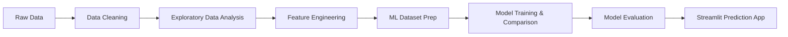
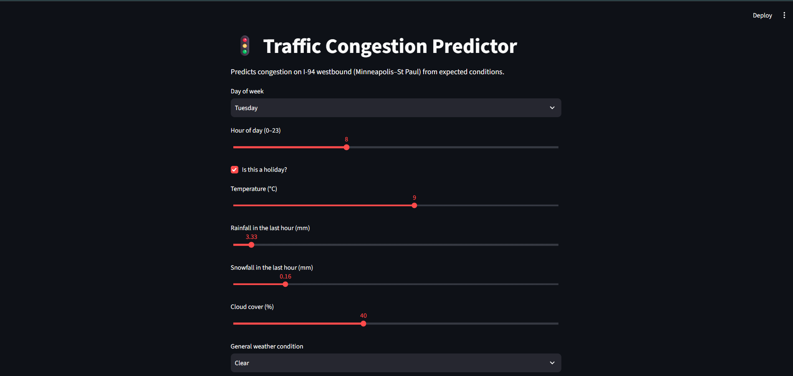
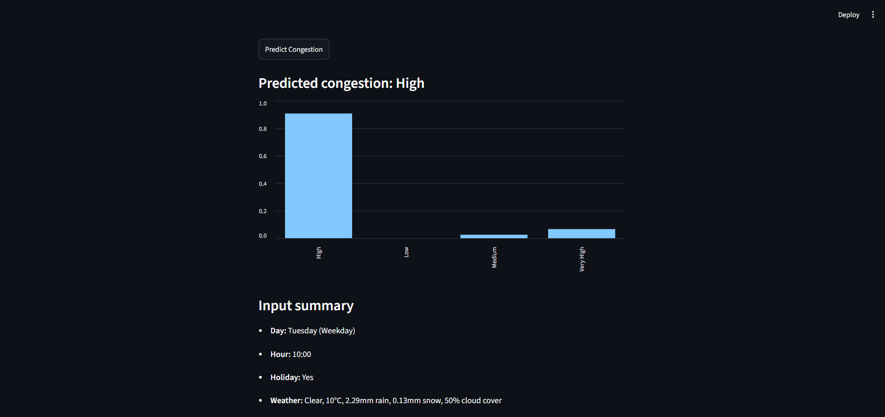

# 🚦 Smart Traffic Congestion Prediction System

🔗 **[Try the live app](https://smart-traffic-management-system-ahfhdwjg2mrqqig74agk7r.streamlit.app/)**

A machine learning system that predicts traffic congestion levels from historical traffic and weather data, deployed as an interactive web app.

## 📌 Project Overview

This project analyzes 6 years of hourly traffic data from I-94 westbound (Minneapolis–St Paul) to predict congestion levels (Low / Medium / High / Very High) based on time, weather, and holiday conditions. A trained model powers a Streamlit web app where anyone can enter expected conditions and get a live prediction.

**Dataset:** [Metro Interstate Traffic Volume](https://archive.ics.uci.edu/dataset/492/metro+interstate+traffic+volume) (UCI Machine Learning Repository) — 48,204 hourly records, 2012–2018.

## 🔄 Project Architecture



## 📸 Screenshots




## 🛠️ Tech Stack
- **Language:** Python
- **Data processing:** pandas, numpy
- **Visualization:** matplotlib, seaborn
- **Machine Learning:** scikit-learn
- **Web app:** Streamlit
- **Version control:** Git & GitHub

## 📊 Machine Learning Approach

Four classification models were trained and compared to predict `congestion_level` (a 4-class target derived from traffic volume via quartile binning):

| Model | Accuracy | Macro F1 |
|---|---|---|
| **Decision Tree (chosen)** | 86.77% | 0.8682 |
| Random Forest | 87.01% | 0.8701 |
| KNN | 84.44% | 0.8438 |
| Logistic Regression | 81.75% | 0.8175 |

**Final model: Decision Tree Classifier.** Although Random Forest scored marginally higher on aggregate accuracy, Decision Tree was selected because it made zero occurrences of the most dangerous possible error (predicting "Low" congestion when the true level was "Very High") on the test set, and offers clearer interpretability.

## 📁 Repository Structure

smart-traffic-management-system/
├── app/                  # Streamlit prediction app
├── data/
│   ├── raw/              # Original downloaded dataset
│   └── processed/        # Cleaned and feature-engineered data
├── models/               # Trained model files (.pkl)
├── notebooks/            # Step-by-step analysis notebooks
├── screenshots/          # Screenshots of the Streamlit app
├── src/                  # Dataset download script
├── .gitignore
├── README.md
└── requirements.txt


## 🚀 Setup Instructions

1. Clone the repository:
```bash
   git clone https://github.com/vaishnavi12148/Smart-Traffic-management-System.git
   cd Smart-Traffic-management-System
```
2. Create and activate a virtual environment:
```bash
   python -m venv venv
   venv\Scripts\Activate.ps1      # Windows
```
3. Install dependencies:
```bash
   pip install -r requirements.txt
```

## ▶️ Usage

**To explore the analysis:** open the notebooks in `notebooks/` in order (01 through 07) in Jupyter/VS Code.

**To run the prediction app:**
```bash
streamlit run app/app.py
```
Enter a day, hour, holiday status, and weather conditions to get a predicted congestion level with confidence scores.

## 📈 Key Findings from Exploratory Analysis

- Traffic follows a clear commuter pattern, with two daily peaks (~7–8am and ~3–4pm) on weekdays only.
- Weekday traffic is consistently higher than weekend traffic.
- Weather conditions showed surprisingly weak correlation with traffic volume — time-of-day and day-of-week are far stronger predictors.
- Holidays show reduced traffic compared to regular weekdays.

## ⚠️ Limitations

- The dataset covers a single location (I-94 westbound), so the model reflects that specific corridor, not city-wide traffic.
- Predictions are based on historical patterns (2012–2018), not live real-time data.
- Congestion levels are relative (quartile-based) categories from this dataset, not standardized absolute traffic thresholds.
- This project does not model real emergency vehicle routing or control real traffic infrastructure.

## 🔮 Future Improvements

- Multi-location route analysis using graph-based pathfinding (Dijkstra/A*) to recommend routes across a road network.
- Power BI dashboard for interactive traffic analytics.
- Hyperparameter tuning and cross-validation.
- Integration with a live traffic/weather data feed.

## 👤 Author

Vaishnavi Phadatare
